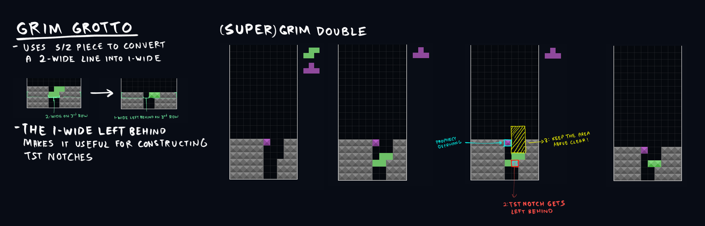

# Skims
- Skims are useful for saving time for making T-Spin Triple layouts. Although they break back to back, they do add firepower in case you can't stack for one!

## Grim Grotto
- Grim Grotto: Slotting in an S/Z into a 2-wide hole horizontally will replace the row with a 1 wide hole. This proves to be useful in building TST notches.
    - Super Grim Double: This is important for making STSD, take note! So now 3-height 2wide holes are now easy pickings for STSD!
        - Make sure the vicinity the S/Z is pointing at is clear before you do this, otherwise you can't fit the T in!
    - If you create a 2 wide well above a TSD, you can skim into a Trinity!
        - You would be surprised how frequently this happens..

## Shallow Grave
- Shallow Grave: Slotting in a J/L into a lopsided TSD slot will equalize the height of both sides
    - You can't really spin it since this kind of unequalizes the heights again..
    - Shallow grave can also be used to make TST bends. In this case, it gets called Ice Axe.